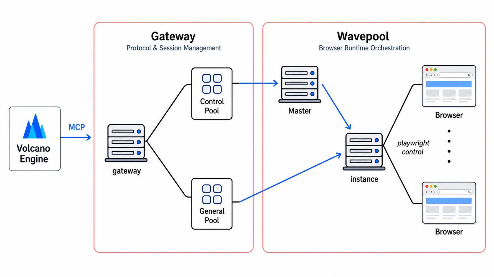
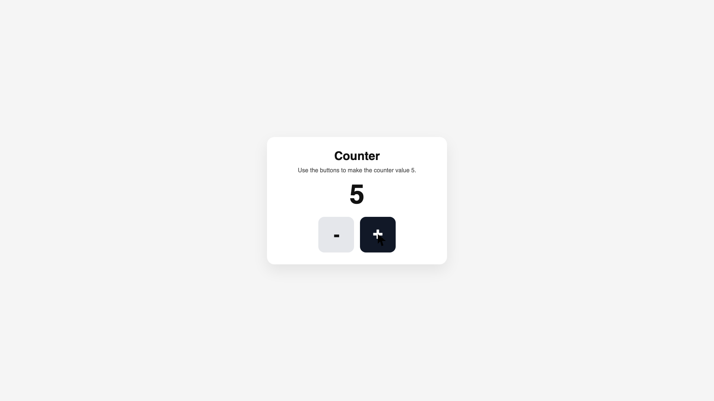
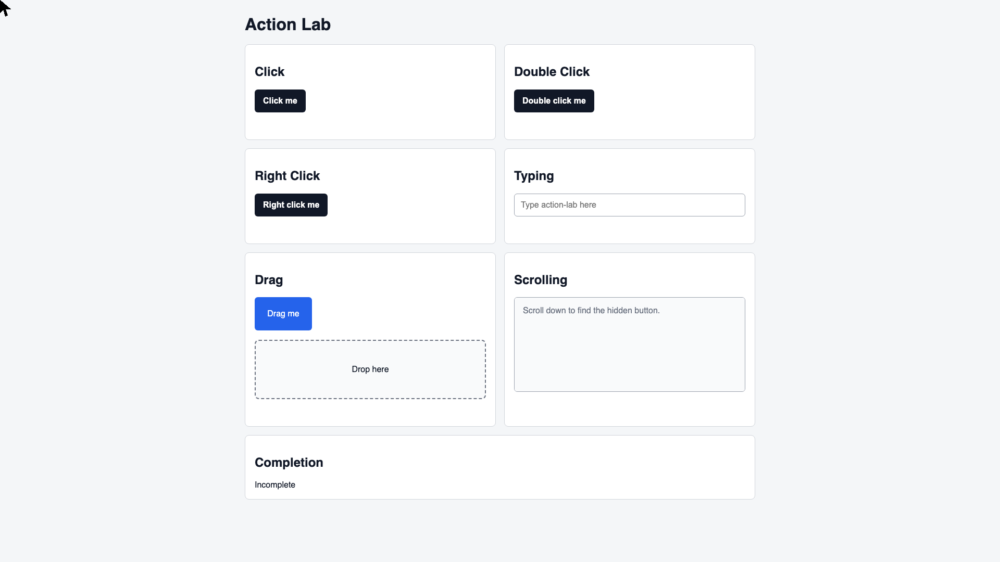
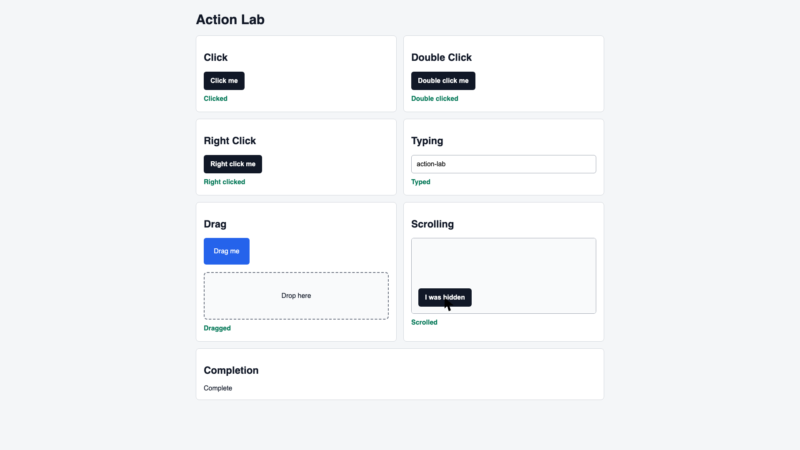
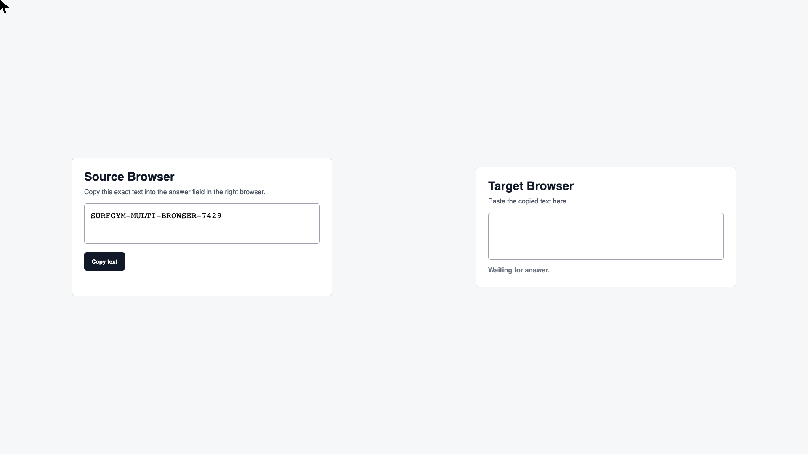
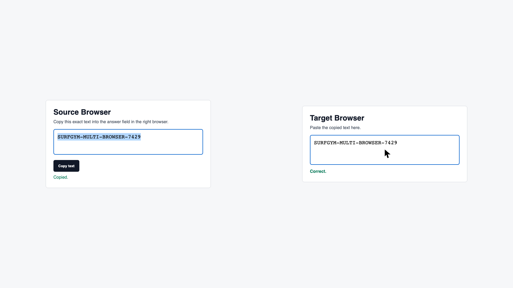

# SurfGym

```bash
cd surfgym

conda create -n surfgym python=3.10
conda activate surfgym

pip install -U pip uv
UV_CACHE_DIR=.uv-cache \
VIRTUAL_ENV="$CONDA_PREFIX" \
uv sync --active --all-packages --inexact

python -m playwright install chromium

# Linux only
playwright install-deps chromium


sudo apt install -y debian-keyring debian-archive-keyring apt-transport-https curl

curl -1sLf 'https://dl.cloudsmith.io/public/caddy/stable/gpg.key' \
  | sudo gpg --dearmor -o /usr/share/keyrings/caddy-stable-archive-keyring.gpg

curl -1sLf 'https://dl.cloudsmith.io/public/caddy/stable/debian.deb.txt' \
  | sudo tee /etc/apt/sources.list.d/caddy-stable.list

sudo apt update
sudo apt install caddy
```

<!-- 
**SurfGym** is a web-based rollout environment for computer-use agents (CUA). It provides a Gateway API based on the Computer13 action space for manipulating web browsers, evaluates task outcomes with rule-based reward functions, and includes a Playwright-powered browser backend that supports single- and multi-browser tasks.

<br/>

<div align="center">

</div>

<br/>

## Table of Contents

<!--TOC-->

- [Getting Started](#getting-started)
  - [1. Set up the environment](#1-set-up-the-environment)
  - [2. Start the servers](#2-start-the-servers)
- [Server Configuration](#server-configuration)
- [Defining Tasks](#defining-tasks)
  - [Single-Browser Task](#single-browser-task)
  - [Multi Browser Task](#multi-browser-task)
- [Testing](#testing)
  - [Manual Action Test](#manual-action-test)
  - [Parrallel Manual Action Test](#parrallel-manual-action-test)
- [Examples](#examples)
  - [Counter](#counter)
  - [Action](#action)
  - [Copy Left to Right](#copy-left-to-right)
  - [Spreadsheet](#spreadsheet)
  - [Spreadsheet2](#spreadsheet2)

<!--TOC-->

<!-- md_toc -s 1 --in-place github --header-levels 3 README.md -->

<br/>

## Getting Started

### 1. Set up the environment

```bash
git clone https://github.com/cua-bootcamp/surfgym
cd surfgym

conda create -n surfgym python=3.10 -y
conda activate surfgym

pip install -U pip uv
uv pip install -r requirements.txt
```

<br/>

Install Playwright's Chromium runtime and any required system dependencies:

```bash
playwright install chromium

# Linux only
playwright install-deps chromium

```

<br/>

### 2. Start the servers

SurfGym runs two server components: the **Gateway server** and the **WavePool server**. For easier monitoring, we recommend running them in separate terminal sessions.

Both servers can be configured through `scripts/config.json`. See [Server Configuration](#server-configuration) for details. You **do not** need to modify `scripts/setting.sh`.


<br>

Start the WavePool server:

```bash
bash scripts/wavepool_launch.bash
```

Start the Gateway server:
```bash
bash scripts/gateway_launch.bash
```

<br/>

Check that both servers are running:

```bash
bash scripts/health_check.bash
```

<br/>

## Server Configuration

TODO 😭

<br/>

## Defining Tasks

Tasks are defined as a JSON list of task objects. SurfGym supports both **single-browser** and **multi-browser** tasks.

<br/>

### Single-Browser Task

A single-browser task uses a single URL string in the `website` field.

```json
{
  "task_id": "counter",
  "instruction": "Make the counter value 5.",
  "website": "http://127.0.0.1:8123/counter.html",
  "evaluation": {
    "operator": "and",
    "rules": {
      "selector": "#count",
      "target": "text",
      "value": "5",
      "match": "exact"
    }
  }
}
```


<br>

`evaluation` defines how the final browser state is converted into a reward.

- `operator` controls how multiple rules are combined. Use `and` when all rules must pass, or `or` when at least one rule must pass. This field is *optional* and defaults to `and`.
- `rules` defines one or more checks against the final browser state. It can be either a single rule object or a list of rule objects.


    | Field | Description | Allowed values | Optional | Default |
    | --- | --- | --- | :---: | --- |
    | `selector` | CSS selector for element-level checks. Omit it for page-level checks such as `url` or `title`. | Any valid CSS selector | O |  |
    | `target` | Defines what to check. | `text`, `html`, `url`, `title`, `attr` | O | `text` |
    | `attr` | Attribute name to inspect when `target` is `attr`, for example `value`. | Any attribute name | O |  |
    | `value` | Expected value. | String |  |  |
    | `match` | Controls how `value` is matched. | `contains`, `exact`, `regex` | O | `contains` |
    | `normalize_space` | Controls whether whitespace is collapsed before matching. | `true`, `false` | O | `false` |
    | `case_sensitive` | Controls whether matching is case-sensitive. | `true`, `false` | O | `true` |


<br/>

**Examples**

```json
{
  "selector": "#answer",
  "target": "attr",
  "attr": "value",
  "value": "hello",
  "match": "exact"
}
```

```json
{
  "target": "url",
  "value": "example.com",
  "match": "contains"
}
```

<br/>

### Multi Browser Task

A multi-browser task opens multiple websites in the same rollout. Each website is assigned an `id`, and each evaluation rule should include `website_id` to specify which browser state should be checked.

```json
{
  "task_id": "copy_left_to_right",
  "instruction": "Copy the exact text from the left browser into the answer field in the right browser.",
  "website": [
    {
      "id": "left",
      "url": "http://127.0.0.1:8123/copy_source.html"
    },
    {
      "id": "right",
      "url": "http://127.0.0.1:8123/copy_target.html"
    }
  ],
  "evaluation": {
    "operator": "and",
    "rules": [
      {
        "website_id": "right",
        "selector": "#answer",
        "target": "attr",
        "attr": "value",
        "value": "SURFGYM-MULTI-BROWSER-7429",
        "match": "exact"
      }
    ]
  }
}
```

In this example, the reward is computed from the right browser only. The other evaluation fields follow the same rules described in the single-browser task section.

<br/>

**SurfGym** currently supports up to four websites in a single task. Websites are opened in the order they appear in the website list and arranged as shown below.

```text
* Single-Browser Task     * Double-Browser Task
# +-----+-----+           # +-----+-----+
# |           |           # |     |     |
# |     1     |           # |  1  |  2  |
# |           |           # |     |     |
# +-----+-----+           # +-----+-----+

* Triple-Browser Task     * Quadruple-Browser Task
# +-----+-----+           # +-----+-----+
# |     |  2  |           # |  1  |  2  |
# |  1  +-----+           # +-----+-----+
# |     |  3  |           # |  3  |  4  |
# +-----+-----+           # +-----+-----+
```

<br/>

## Testing

### Manual Action Test

You can test a single task with a manually written action sequence.

```bash
bash tests/manual_test.sh
```

<br/>

Before running the test, review the user-defined values in `tests/setting.sh` and `tests/runners/manual/run.py`.

```bash
# tests/setting.sh

# ==================================================================================
# User-defined settings
# Modify only the values below for testing.
# 
# * Use the appropriate SURFGYM_CONFIG for the target test
# * Make sure to set WITH_FIXTURE_WEBSITE=true when using fixture websites
# ==================================================================================

readonly SURFGYM_CONFIG="$FIXTURE_DIR/config/config-single.json"

readonly WITH_FIXTURE_WEBSITE=true
readonly FIXTURE_WEBSITE_PORT=8123

# ==================================================================================
```

```python
# tests/runners/manual/run.py

# ============================================================
# User-defined settings
# Modify only the values below for testing.
# ============================================================
TASK_ID = "counter"
ACTIONS: list[list[dict[str, Any]]] = [
    [
        {
            "action_type": "CLICK",
            "button": "left",
            "num_clicks": 5,
            "x": 849,
            "y": 303,
        },
    ]
]
```

<br>

### Parrallel Manual Action Test

TODO 😭

<br>

## Examples

The following examples show action sequences that can be used with the manual action test. Each example targets one fixture task and should receive a `1.0` reward when executed successfully.

<br/>

### Counter

This example tests basic mouse clicking. The agent clicks the counter button once with explicit coordinates, then clicks the same position four more times by reusing the current cursor position.


<div align="center">
  
  
</div>

<br/>

```python
TASK_ID = "counter"
ACTIONS: list[list[dict[str, Any]]] = [
    [
        {
            "action_type": "CLICK",
            "x": 1016,
            "y": 631,
        },
    ],
    [
        {"action_type": "CLICK", "num_clicks": 4},
    ],
]
```

<br>

### Action

This example covers the main Computer13 browser actions supported by SurfGym, including click, double click, right click, typing, mouse movement, drag, scroll, and clicking an element after scrolling.

<div align="center">


</div>

<br/>

```python
TASK_ID = "action"
ACTIONS: list[list[dict[str, Any]]] = [
    [{"action_type": "CLICK", "x": 537, "y": 193}],
    [{"action_type": "DOUBLE_CLICK", "x": 1063, "y": 193}],
    [{"action_type": "RIGHT_CLICK", "x": 559, "y": 393}],
    [{"action_type": "CLICK", "x": 1209, "y": 393}],
    [{"action_type": "TYPING", "text": "action-lab"}],
    [{"action_type": "MOVE_TO", "x": 543, "y": 604}],
    [{"action_type": "DRAG_TO", "x": 800, "y": 710}],
    [{"action_type": "MOVE_TO", "x": 1200, "y": 700}],
    [{"action_type": "SCROLL", "dx": 0, "dy": 700}],
    [{"action_type": "CLICK", "x": 1067, "y": 715}],
]
```

<br>

### Copy Left to Right

This example tests a multi-browser rollout. The agent clicks the source text in the left browser, moves to the input field in the right browser, and pastes the copied value.


<div align="center">


</div>

<br/>

```python
TASK_ID = "copy_left_to_right"
ACTIONS: list[list[dict[str, Any]]] = [
    [
        {
            "action_type": "CLICK",
            "x": 245,
            "y": 622,
        },
    ],
    [
        {
            "action_type": "CLICK",
            "x": 1440,
            "y": 561,
        },
    ],
    [
        {
            "action_type": "HOTKEY",
            "keys": ["ControlOrMeta", "v"],
        },
    ],
]
```

<br/>

### Spreadsheet

```python
TASK_ID = "spreadsheet_1"
ACTIONS: list[list[dict[str, Any]]] = [
    [{"action_type": "WAIT"}, {"action_type": "WAIT"}, {"action_type": "WAIT"}],
    [
        {"action_type": "PRESS", "key": "ArrowRight"},
        {"action_type": "PRESS", "key": "ArrowDown"},
        {"action_type": "PRESS", "key": "ArrowDown"},
        {"action_type": "PRESS", "key": "ArrowDown"},
        {"action_type": "PRESS", "key": "ArrowDown"},
        {"action_type": "TYPING", "text": "5"},
        {"action_type": "PRESS", "key": "Enter"},
    ],
]
```

<br/>

### Spreadsheet2

```python
TASK_ID = "spreadsheet_2"
ACTIONS: list[list[dict[str, Any]]] = [
    [
        {"action_type": "WAIT"},
        {"action_type": "WAIT"},
        {"action_type": "CLICK", "x": "1100", "y": "50"},
    ],
    [
        {"action_type": "PRESS", "key": "ArrowRight"},
        {"action_type": "PRESS", "key": "ArrowDown"},
        {"action_type": "PRESS", "key": "ArrowDown"},
        {"action_type": "PRESS", "key": "ArrowDown"},
        {"action_type": "PRESS", "key": "ArrowDown"},
        {"action_type": "TYPING", "text": "5"},
        {"action_type": "PRESS", "key": "Enter"},
    ],
]
``` -->